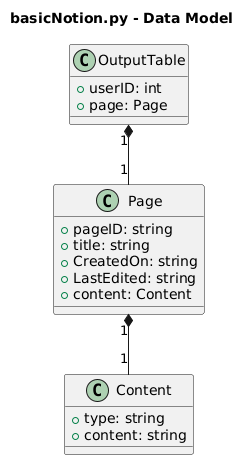

# 🚨 READ THIS FIRST: skim through desc is cool but do the walkthrough I think it'll help you

## Table of Contents:
- [Quick Description](#quick-description)
- [Walkthrough](#-walkthrough)
    - [basicNotion.py](#basicnotionpy)


# Quick Description:
## File: <a href = "https://github.com/johncizin/forAnya_py/blob/main/src/basicNotion.py"> basicNotion.py </a>
- This file reads the data from a table created in the file. It simulates an API call from your computer to Notion's computer. **Notion is simply the example but all applications have an API (Application Programming Interface) that allows it to talk to other programs, while encapsulating its own data.**
## File: <a href = "https://github.com/johncizin/forAnya_py/blob/main/src/anotherNotion_json.py"> anotherNotion_json.py
- This python file reads data from an existing <a href="https://github.com/johncizin/forAnya_py/blob/main/src/pseudoOutput.json"> JSON file included in this repo. </a> **JSON (JavaScript Object Notion) is a human-readable text format commonly used when exhanging data, e.g. calling an API it returns a JSON formatted data. Just think of it as a specific language that some APIs use to talk to each other.**

# 🟢 Walkthrough
## basicNotion.py
### Data Structure of File (Dictionary):
<p align="center">
     
</p>

> *This UML-style diagram models the nested dictionary structure returned by the simulated API call.*

In python code it looks like:
```python
simplfifiedOutputTable = {
    "userID": 13456767, 
    "page" : {
         "pageID": "hdjkfswhefuewfhd343456564534465",
        "title" : "My Homework",
        "CreatedOn" : "2026-01-03",
        "LastEdited" : "2026-01-03",
        "content" : {
           "type" : "string",
           "content": "This is my First heading"
        }
    }
}
```

### Function Explanations:
#### getNotionData()
```python
def getNotionData():
    return simplfifiedOutputTable
```
- This is what I'm gonna call a "Dummy Method" (a placeholder that mimics real API behavior) because it actually has no functional value
- My reasoning for including it is in the function [callAPI](#callapi) is to simply to simulate the "output" of an API because when we are working with an API we won't have the luxury of having the data already available to use defined as a dictionary in the code.

#### callAPI()
```python
def callAPI():
    try:
        data = getNotionData()
        print("Data retrieved successfully:")
        processData(data)
    except Exception as e:
        print("An error occurred while calling the Notion API:", str(e))
```
- This function simulates an API call
- We get the data from our [dummy method](#getnotiondata) and I wrapped it in a `try` block
    - A `try` block does exactly what it sounds like: it *attempts* to run code that might fail.  When working with external systems like APIs, things can go wrong (network issues, bad responses, invalid data). Using `try` lets the program handle those errors gracefully instead of crashing, so we can see *what* failed and *why*.

#### processData(data)
```python

def processData(data):
    print("Processing Data...")
    print("User ID:", data["userID"])
    page = data["page"]
    print("Page ID:", page["pageID"])
    print("Title:", page["title"])
    print("Created On:", page["CreatedOn"])
    print("Last Edited:", page["LastEdited"])
    content = page["content"]
    print("Content Type:", content["type"])
    print("Content:", content["content"])

```
- Super simple, I'm just indexing the dictionary with the `keys` we defined [here](#data-structure-of-file-dictionary)
- I print out the values at each key and thats what you'll see in the terminal.
##### Example Output:
```
Data retrieved successfully:
Processing Data...
User ID: 13456767
Page ID: hdjkfswhefuewfhd343456564534465
Title: My Homework
Created On: 2026-01-03
Last Edited: 2026-01-03
Content Type: string
Content: This is my First heading
```
## 🧠 Challenges using [basicNotion.py](#basicnotionpy):

**All that talking was getting mad boring now u try 🙏🏿**

**Difficulty Key**
- 🟢 Easy
- 🟡 Medium
- 🔴 Hard
---

### 🟢 Challenge 1:
**Goal:** Practice accessing dictionary keys

- Create a function that: 
    - Prints **only** the page title to the terminal
    - You can modify the data and see different output too

💡 *Hint:*  
The title is nested inside the `page` dictionary.


<details>
  <summary><strong>Solution</strong></summary>

  One possible solution is to directly access the nested keys:

  ```python
  def printTitle():
      print("Title:", simplfifiedOutputTable["page"]["title"])
``` 
</details>


---

### 🟡 Challenge 2: Loop Instead of Hardcoding
**Goal:** Reduce repetition and improve flexibility

- Loop through the `simplfifiedOutputTable` dictionary
- Print each key and its value dynamically
- Replace [processData(data)](#processdatadata) function with your solution.

💡 *Hint:*  
Use `.items()` to access key–value pairs.

<details>
  <summary><strong>Solution</strong></summary>

  ```python
  def processData(data):
    for key, value in data.items():
        print("Key: ", key, "Value: ", value)
```
</details>

---
### 🔴 Challenge 3: User Input Layer
**Goal:** Connect user input to program behavior

- Prompt the user for input using `input()`
- Based on the input, print a specific value from the dictionary

Example behavior:

> If the *user* enters: 0
>
> The program outputs: *My Homework* (The Title of the Page)

💡 *Hint:*  
- `input()` always returns a string  
- You can use `if` statements to decide what to print  

🧠 *Optional:*  
- Add another option (ex: `1` for Page ID) 

<details>
  <summary><strong>Solution</strong></summary>
  Bruh you thought 😭 TRY IT
    <p align="center">
     
</p> 
</details>


